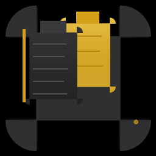

<p align="center">
  <picture>
    <source media="(prefers-color-scheme: dark)" srcset="Resources/Assets.xcassets/AppIcon.appiconset/icon-256.png">
    
  </picture>
</p>

<h1 align="center">Jacque-Copy</h1>

<p align="center"><strong>A beautiful dual clipboard built specifically for macOS.</strong></p>

<p align="center">
  <a href="https://github.com/jacquecopy/jacque-copy/releases/latest"></a>
  <a href="https://github.com/jacquecopy/jacque-copy/blob/main/LICENSE"></a>
  
  <a href="https://github.com/jacquecopy/jacque-copy/actions"></a>
</p>

---

<p align="center">
  <a href="https://github.com/jacquecopy/jacque-copy/releases/latest">
    
  </a>
</p>

<p align="center">
  <sub>Requires macOS 14 (Sonoma) or later &nbsp;·&nbsp; Intel &amp; Apple Silicon &nbsp;·&nbsp; Free &amp; Open Source</sub>
</p>

---

## What is Jacque-Copy?

macOS gives you **one** system clipboard. Jacque-Copy gives you a **second**, completely independent one.

This is not clipboard history. Not multiple tabs. Not categories. **It's literally another clipboard.**

| Clipboard A | Clipboard B |
|:---:|:---:|
| Your normal system clipboard | A fully independent secondary clipboard |
| ⌘C to copy &nbsp;·&nbsp; ⌘V to paste | ⌃C to copy &nbsp;·&nbsp; ⌃V to paste |
| **Nothing changes** — macOS works exactly as before | **Never overwrites** Clipboard A |

> Copy `Apple` with ⌘C, then copy `Orange` with ⌃C. Press ⌘V → you get `Apple`. Press ⌃V → you get `Orange`. Neither clipboard ever destroys the other.

---

## 🚀 Quick Start

### 1. Download

**[→ Download the latest DMG from GitHub Releases](https://github.com/jacquecopy/jacque-copy/releases/latest)**

Get `JacqueCopy-*.dmg` from the latest release.

### 2. Install

Open the DMG and drag **Jacque-Copy** into your **Applications** folder.

### 3. Launch

Launch Jacque-Copy from Applications. It appears in your menu bar — look for the clipboard icon with a gold accent.

### 4. Grant Permission

On first launch, grant **Accessibility** permission when prompted (System Settings → Privacy & Security → Accessibility). This is required for the secondary clipboard hotkeys.

### 5. Use It

- **⌃C** — Copy to Clipboard B
- **⌃V** — Paste from Clipboard B

That's it. You now have two clipboards.

---

## ✨ Features

<table>
<tr>
<td width="50%">

### 🔀 True Dual Clipboard
Two independent clipboards that never interfere. Clipboard A uses ⌘C/⌘V exactly as macOS works today. Clipboard B uses ⌃C/⌃V — fully configurable.

### 🎨 Rich Content
Preserves **every** pasteboard representation. Plain text, rich text, RTF, HTML, Markdown, images (PNG, JPEG, TIFF, SVG), PDF, URLs, files, folders — stored exactly as-is.

### 📋 History
Each clipboard has its own independent history. Configurable sizes from 10 to unlimited. Smart deduplication. Persists across reboots.

</td>
<td width="50%">

### 📌 Pinned & Favorites
Pin important items. Mark favorites. Search, sort, and filter across both clipboards instantly.

### 🔍 Instant Search
Type to filter history immediately. Arrow keys to navigate. Return to paste. Escape to close.

### 🎛️ Fully Customizable
Custom shortcuts with conflict detection. Four themes: System, Light, Dark, and **Black & Gold** (default). Custom accent colors. Adjustable animation speeds.

### ⚡ Lightweight
Zero idle CPU. Under 20 MB RAM. Event-driven — no polling, no busy loops. Native performance.

</td>
</tr>
</table>

---

## ⌨️ Default Shortcuts

| Action | Shortcut | Description |
|---|---|---|
| Copy (Clipboard A) | ⌘C | Normal macOS copy — nothing changes |
| Paste (Clipboard A) | ⌘V | Normal macOS paste |
| **Copy to B** | **⌃C** | Copy selected content to secondary clipboard |
| **Paste from B** | **⌃V** | Paste secondary clipboard content |
| Toggle History | ⌘⇧V | Open/close the full history browser |
| Show Menu Bar | ⌘⇧J | Open the menu bar popover |
| Clear Clipboard B | ⌃⌥X | Wipe the secondary clipboard |
| Swap Clipboards | ⌃⌥S | Exchange contents of A and B |

*All shortcuts can be customized in **Settings → Hotkeys**.*

---

## 📦 Installation

### Option 1: Download (Recommended)

**[→ Get the latest release](https://github.com/jacquecopy/jacque-copy/releases/latest)** — download the DMG, drag to Applications, done.

### Option 2: Homebrew *(coming soon)*

```bash
brew install --cask jacque-copy
```

### Option 3: Build from Source

```bash
git clone https://github.com/jacquecopy/jacque-copy.git
cd jacque-copy
xed .                         # open in Xcode
swift build -c release        # or build from command line
```

See [BUILD.md](Documentation/BUILD.md) for detailed instructions including signing and notarization.

---

## 📋 Requirements

| | |
|---|---|
| **macOS** | 14.0 (Sonoma) or later |
| **CPU** | Intel (x86_64) or Apple Silicon (arm64) |
| **Permission** | Accessibility (required for secondary clipboard hotkeys) |

---

## 🏗️ Architecture

Built with **Swift** + **SwiftUI** + **AppKit** using MVVM architecture with dependency injection and async/await.

```
CGEventTap → HotkeyManager → ClipboardEngine → PasteboardManager → NSPasteboard
                                  ↕
                             HistoryStore → JSON files on disk
                                  ↕
                     SwiftUI Views (MenuBar, Settings, History)
```

For a detailed breakdown, see [ARCHITECTURE.md](Documentation/ARCHITECTURE.md).

---

## 📚 More Documentation

| Document | |
|---|---|
| [INSTALL.md](Documentation/INSTALL.md) | Full installation guide with permissions setup |
| [BUILD.md](Documentation/BUILD.md) | Build from source, signing, notarization |
| [ARCHITECTURE.md](Documentation/ARCHITECTURE.md) | Architecture and data flow |
| [FAQ.md](Documentation/FAQ.md) | Frequently asked questions |
| [CHANGELOG.md](Documentation/CHANGELOG.md) | Version history |
| [ROADMAP.md](Documentation/ROADMAP.md) | Future plans |
| [SECURITY.md](Documentation/SECURITY.md) | Security policy |

---

## 🤝 Contributing

Contributions welcome! See [CONTRIBUTING.md](Documentation/CONTRIBUTING.md) for guidelines.

---

## 📄 License

Jacque-Copy is [MIT licensed](LICENSE). Free, open source, forever.

---

<p align="center">
  <sub>Built with ❤️ for macOS &nbsp;·&nbsp; Not affiliated with Apple Inc.</sub>
</p>
